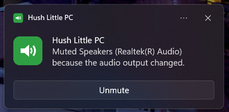
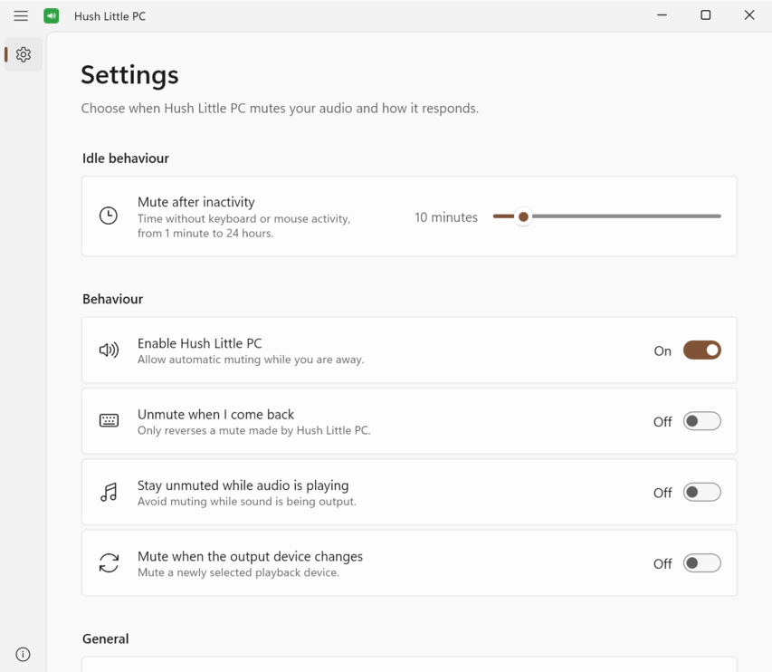

# Hush Little PC

A quiet Windows tray utility that automatically mutes your default playback device after a configurable period of keyboard and mouse inactivity.

Step away from your PC and Hush Little PC quietly mutes the sound. It runs in the background from the notification area: click the tray icon to turn it on or off.

<a href="https://get.microsoft.com/installer/download/9pdnxtb6mg9l?referrer=appbadge" target="_self">
  
</a>



## Features

- **Idle muting:** mutes your default playback device after 1 minute to 24 hours without keyboard or mouse input.
- **Runs in the background:** starts in the notification area. The settings window opens on the first run, and afterwards only when you open it (or turn on **Open settings on startup**).
- **One-click toggle:** left-click the tray icon to enable or disable. The icon changes to show the current state.
- **Native tray menu:** right-click for Enabled, Mute now, Settings, and Exit.
- **Unmute when I come back (optional):** only unmutes if Hush Little PC muted the device itself.
- **Stay unmuted while audio is playing (optional):** avoids muting while sound is being output.
- **Mute on output change (optional):** mutes the new default device when Windows switches playback devices.
- **Notification with an Unmute button (optional):** a native Windows notification when the app mutes an unmuted device.
- **Start with Windows (optional):** per-user startup registration; no administrator rights required.
- **Native Fluent settings:** WinUI 3 settings cards, Mica material on Windows 11, light and dark themes, and adaptive navigation.



## Requirements

- Windows 10 version 2004 (build 19041) or later, or Windows 11.
- x64 release builds.

The portable and Microsoft Store distributions include the required .NET and Windows App SDK runtimes. You do not need to install either runtime separately.

## Install

- **Microsoft Store:** install [Hush Little PC from the Microsoft Store](https://apps.microsoft.com/store/detail/9PDNXTB6MG9L?cid=DevShareMCLPCS). Updates are delivered by the Store.
- **Portable:** download `HushLittlePC_<version>_x64-portable.exe` from the [Releases](../../releases) page.

## Build

Install the [.NET 10 SDK](https://dotnet.microsoft.com/download).

Restore and build the complete solution:

```powershell
dotnet restore HushLittlePC.sln
dotnet build HushLittlePC.sln -c Release
dotnet test tests/HushLittlePC.Tests.csproj -c Release
```

### Run the WinUI 3 application locally

Run the WinUI 3 application from source:

```powershell
dotnet run --project src/WinUI/HushLittlePC.WinUI.csproj
```

In Visual Studio, set **HushLittlePC.WinUI** as the startup project.

Publish the self-contained WinUI portable executable:

```powershell
dotnet publish src/WinUI/HushLittlePC.WinUI.csproj -c Release -r win-x64 --self-contained true `
  -p:WindowsAppSDKSelfContained=true -p:EnableMsixTooling=true `
  -p:IncludeAllContentForSelfExtract=true -p:PublishSingleFile=true
```

The portable executable is created under `src/WinUI/bin/Release/net10.0-windows10.0.19041.0/win-x64/publish/`.

The Store MSIX package is assembled by `.github/scripts/package-msix.ps1`. The release workflow runs both packaging paths after CI succeeds on `main`.

## Pre-commit checks

Install [pre-commit](https://pre-commit.com/) and enable the hooks:

```powershell
python -m pip install pre-commit
pre-commit install
```

Before each commit, the hooks check whitespace, final newlines, merge-conflict markers, YAML syntax, and Conventional Commit messages. Run all checks manually with:

```powershell
pre-commit run --all-files
```

## Usage

Hush Little PC runs in the notification area. The settings window opens on the first run; after that, open it from the tray menu (or turn on **Open settings on startup**). Starting the app again while it's already running does nothing, because only one copy runs at a time.

Closing the settings window keeps Hush Little PC running in the notification area. To quit, choose **Exit** from the tray menu.

| Action | Result |
| --- | --- |
| Left-click the tray icon | Enable or disable idle muting |
| Right-click the tray icon | Open the menu (Enabled, Mute now, Settings, Exit) |

### Settings

| Setting | Default | Description |
| --- | --- | --- |
| Mute after inactivity | 10 minutes | Idle time before muting, from 1 minute to 24 hours. The slider steps are finer at short timeouts. |
| Enable Hush Little PC | On | Turns automatic muting on or off. Same as left-clicking the tray icon. |
| Unmute when I come back | Off | Unmutes on activity, only if Hush Little PC muted the device. |
| Stay unmuted while audio is playing | Off | Skips muting while sound is being output. |
| Mute when the output device changes | Off | Mutes the new default playback device when Windows switches outputs. |
| Show mute notifications | On | Shows a Windows notification with an Unmute action. |
| Run at startup | Off | Starts Hush Little PC when you sign in. Portable build: uses the per-user Run key. Store build: uses the package StartupTask (manage it under **Settings > Apps > Startup**). |
| Open settings on startup | Off | Opens the settings window each time the app starts. When off, the app starts in the notification area; the window still opens on the first run. |

Settings are saved automatically as you change them to `%AppData%\HushLittlePC\settings.json`. For the Store version, Windows redirects this folder to the package's private storage and removes it when you uninstall.

## How it works

- Idle time comes from the Win32 `GetLastInputInfo` API, checked once per second. Only keyboard and mouse input counts as activity.
- Muting uses the Windows Core Audio API through [NAudio](https://github.com/naudio/NAudio).
- Muting is tracked so the app only unmutes devices it muted itself. The decision logic lives in `HushLittlePC.Core` and is covered by unit tests.
- Output changes are detected through Windows Core Audio device notifications.
- "Audio is playing" is detected from the device's master peak meter.
- Notifications use the [Windows Community Toolkit notifications library](https://learn.microsoft.com/windows/apps/design/shell/tiles-and-notifications/send-local-toast).
- Startup uses the per-user Run registry key for the portable executable and the manifest's StartupTask for the MSIX package.
- The tray icon and menu use H.NotifyIcon.WinUI and a WinUI MenuFlyout; audio and Windows integration remain in the shared Windows services.

## Project layout

| Path | Purpose |
| --- | --- |
| `HushLittlePC.sln` | Solution containing the WinUI app, shared libraries, and tests |
| `src/WinUI/` | WinUI 3 application, Fluent Settings/About pages, and window lifecycle |
| `src/Core/` | Shared settings model, persistence, logging, and platform-independent policy |
| `src/Platform/Windows/` | Audio, idle monitoring, device watching, startup, and notifications |
| `tests/` | MSTest coverage for policy, persistence, and Windows integration, plus the CI smoke test |
| `packaging/` | MSIX manifest, app icon, and Store assets |
| `scripts/` | Developer scripts, such as enabling WinUI crash dumps |
| `store/`, `docs/`, `resources/` | Store listing art, documentation, test guidance, and notification assets |
| `.github/` | CI, semantic-release, and MSIX packaging automation |

## Diagnostics

Hush Little PC writes two best-effort logs to `%LocalAppData%\HushLittlePC\`. Logging never prevents the app from running.

- `winui-app.log`: app startup steps and any startup or unhandled WinUI exceptions. Check this first if the app closes or fails to open.
- `app.log`: errors from settings, audio, and Windows services.

Each log is capped at 512 KiB. When a log reaches the cap it is renamed to `winui-app.old.log` or `app.old.log` (replacing the previous one) and a fresh log starts, so the entries just before the rollover are kept.

If the app crashes without a useful log entry, see [Capturing WinUI crash dumps](docs/winui-crash-dumps.md).

The About page shows the app/runtime version and can copy basic environment diagnostics to the clipboard.

## Contributing

- Pull request titles must follow [Conventional Commits](https://www.conventionalcommits.org/) because the title becomes the commit message on `main` and drives versioning.
- CI formats and builds the full solution, runs unit tests, smoke-tests the WinUI portable app (including under the release file name), and creates a test MSIX package.
- When CI succeeds on `main`, [semantic-release](https://semantic-release.gitbook.io/) creates the version tag and GitHub release, attaches the portable executable, and submits the MSIX package to the Microsoft Store.
- Store publishing requires repository variables `MSIX_IDENTITY_NAME`, `MSIX_PUBLISHER`, and `MSIX_PUBLISHER_DISPLAY_NAME`, plus secrets `TENANT_ID`, `SELLER_ID`, `CLIENT_ID`, `SECRET_VALUE`, and `STORE_ID`.
- See [Windows integration testing](docs/windows-integration-testing.md) for automated coverage and the manual hardware/UI acceptance scenarios.

## Uninstall

1. Turn off **Run at startup** in Settings.
2. Right-click the tray icon and choose **Exit**.
3. Delete the portable executable and, if desired, the `%AppData%\HushLittlePC` (settings) and `%LocalAppData%\HushLittlePC` (logs) folders.

For the Store version, uninstall it from **Settings > Apps > Installed apps**.

## Limitations

- "Mute when the output device changes" reacts to Windows changing the *default device*. Plugging headphones into a wired 3.5 mm jack usually does not change the default device, so it will not trigger.
- Only the default playback device is muted, not every audio device.
- Idle detection is system-wide input only. Playing media without touching the keyboard or mouse counts as idle unless "Stay unmuted while audio is playing" is enabled.

## License

This project is licensed under the [MIT License](LICENSE).
